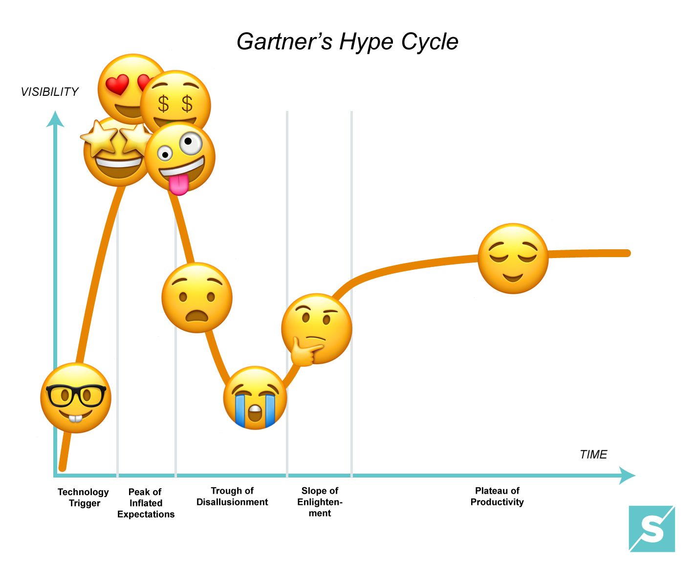
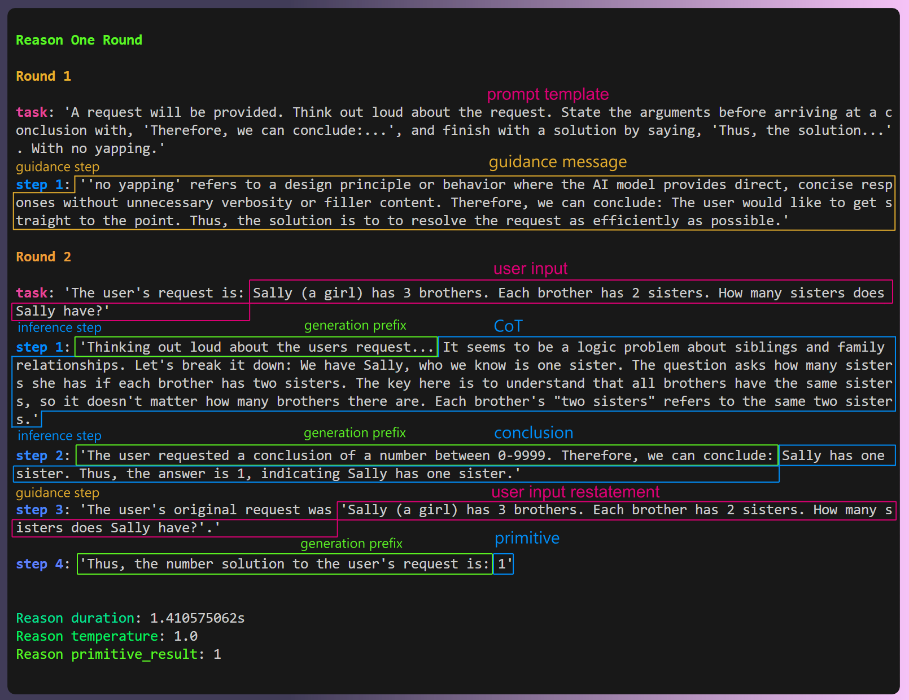

Your personal journey through the [tech hype cycle](https://en.wikipedia.org/wiki/Gartner_hype_cycle) with LLMs probably started with a "Wow!"

(class:'small')

<p class="caption">Maximize cringe.</p3>

It's unprecedented that a system can take any novel input and output a coherent response. Sure, you could argue that with a trillion monkeys writing 'if' statements, you could reproduce this with a classic coding approach, but even the pessimists had to agree LLMs were meaningful... even if wasn't clear what they meant.

Then came the trough of disillusionment. LLMs are just stochastic parrots, mindlessly predicting the next best token. They lie. They're confidently incorrect. 90% of the time they work every time, but that 10% of failures seems unfixable. Also, why would anyone want a chatbot when it's literally the worst interface?

My time in the trough of disillusionment was short; yes, LLMs have problems, but as long they were at _least_ 51% correct across novel, never-before-seen inputs, they could replace a trillion monkeys hard-coding [control flow](https://en.wikipedia.org/wiki/Control_flow) for every conceivable situation.

This has led to **cascading prompt workflows.** This technique conforms the output of LLMs so that they can be used as 'control flow' within an existing codebase. It improves the accuracy, speed, and reliability of existing LLM implementations, and does so with a purely local approach. In this post, I will cover the current state of the technology, and go over this new technique.

# The Prompt Engineering Dichotomy

1. Prompt engineering is a legitimate and required skill for implementing LLMs.
2. Prompt engineering is a meme. If you put "prompt engineer" in your LinkedIn profile, _you_ are the meme.

(class:'small')

<p class="caption">But you can wear this shirt ironically.</p3>

Sorry to put you in a bucket, but that's life when playing with a technology at the peak of its hype cycle.

> All you need to master AI is prompting, and I've already mastered English — I speak it every day!

Devaluing the passion and mastery of writers is always painful. Especially when done by people who have emphatically _not_ mastered the English language. Apologies to all the marketing copywriters out there for revisiting a painful memory.

(class:'medium')

LLMs sit at a strange nexus of culture, natural language, query languages, and machine learning. In traditional tech the 'soft' areas of study, like language and culture, have almost no importance, but in the LLM space the importance of 'hard' and 'soft' implementation details are much more balanced. We all have blinders for unknown unknowns, and engineers are famous in their apathy towards 'soft' subjects. This explains then why 'prompt engineering' is given so little credence, and why there is so much opportunity for improvement here.

If natural language is the query language of LLMs, our success is contingent on showing it the same respect as we do other query languages. I preface with this aside because cascading prompt workflows are, at the end of the day, just advanced prompt engineering.

# The Vibe Space

Vicki Boykis wrote this great blog post, ["We've been put in the vibe space,"](https://vickiboykis.com/2024/05/06/weve-been-put-in-the-vibe-space/) that's been stuck in my head for most of 2024.

> When we go to Twitter/Bluesky/Instagram/Discord/OpenTwang and we are served channel or post or image recommendations, we recognize that we are in the vibe space and can only influence these through our explicit and implicit behavior on a given site, which goes to some great matrix factorization in the sky and pulls out recommended items into a stream, or a timeline, or a carousel. We do this all publicly with the expectation that all our data is harvested and reintegrated into The Algorithm.

(class:'small')

<p class="caption">A critique of a tech stack, in the format of said tech stack; vibes over facts.</p3>

- **Determinism**: The old world computer systems (if statements, SQL queries, and old google search)

- **Vibes**: The new world tech stacks (LLMs, semantic search, and new google search).

Raw LLMs produce outputs that can be described as "vibes" — probabilistic, context-dependent results that may vary between runs. Building on vibes may work for creative applications, but in real-world applications, a lossy, vibey output is a step back from the reliability and consistency of traditional programming paradigms.

This is why the 'GEN AI' trough of disillusionment has trapped so many developers; vibes are the antithesis of what we want from our software.

# Deterministic Signal from Probabilistic LLM Vibes

It's marvelous how well LLMs work considering how simple they are. Due to their simplicity, they've gone from cool science project to universal adoption by the tech-savvy laptop class in less than a year. However, LLM implementation is still a science in its infancy. It's a tech stack without best practices, and there are low hanging fruits ripe for optimization. _Especially when it comes to integrating LLMs into the deterministic real world._

# Enforcing Behavior with Prompts is Naive

When people say, "Why add 'AI' to this?", what they really mean is, "AI does not improve this. Vibifying the output makes it worse." And they're right. Instead, we should integrate LLMs in a way that utilizes there most important ability: producing correct and coherent responses over a wide range of novel scenarios. Essentially, replacing existing control flow, hard-coded deterministic logic trees, with an LLM, but only doing so if the LLM is able to behave as traditional control flow. The challenge here is enforcing conformity in an LLM so that it performs the desired business logic without aberrations or deviations.

There are libraries that offer deterministic use cases for LLMs. But if a library does not mention an interesting new technique in their readme or docs, dive into their codebase and it's usually just prompt templating wrapping the same LLM interfaces. I did that this recently with [autolabel](https://github.com/refuel-ai/autolabel). At it's core, it is a very nice prompt template system, wrapping OpenAI's API. This is the current best practices for an LLM integration; Take a known to work prompt, build an abstraction that allows dynamic uses of it. Done. The downsides to prompt enforced workflows are many.

- Inefficient
  - To reliably get an LLM to follow instructions requires N examples. N is the number it takes for the pattern set in the examples to be reliably followed. N may vary on the task, model, and required accuracy.
  - For each workflow run you must include prompt + N examples in the context.
  - This extra context translates to slower speeds, higher costs, and a larger carbon footprint.
- Performance Degradation
  - With LLMs, as the size _and complexity_ of the context increases, the quality of the output decreases. The large context of the prompt template introduces noise.
  - This reduces the impact of information in the text and reduces quality.
- Difficult
  - Each workflow requires a high level of specificity, crafting, testing, and fine-tuning.
  - This makes it a high-touch, time intensive integration.

In practice, holding together a workflow with natural language _sounds_ more fragile than it is, but ultimately it's relying on suggestions rather than enforcing conformance.

# Extracting Signals from LLMs with Constraints Degrades Quality

To use an LLM within a codebase, the LLM must be able to communicate with the codebase. For example, if the code requires a number to perform an action, a sentence containing that number is not viable. So we need to be able to extract a usable signals from LLM responses.

Using Regex or other pattern matching to extract information from text output is subject to the old adage:

> Some people, when confronted with a problem, think "I know, I'll use regular expressions." Now they have two problems.'

Using Regex to parse the output of LLMs puts an exponent over this old joke.

So it's become common to use constraints libraries like [Microsoft's Guidance](https://github.com/guidance-ai/guidance) and [Outlines](https://github.com/outlines-dev/outlines) to conform the outputs of LLMs to an easy to parse format. This includes techniques like logit bias, stop words, or grammars. However, from practical experience, as well [as studies](https://arxiv.org/abs/2408.02442), we know that constraints such as logit bias and grammars negatively impact the quality of LLMs. Metaphorically speaking, constraints lobotomize LLMs.

# Controlled Generation with Step Based Cascade Workflows

Extracting signals from an LLM output without degrading the quality is actually easy: Just have the LLM perform the workflow to produce the desired signal, and then prompt it with the constraint to extract the signal.

Workflow conformance is much more difficult. Constraints _are_ deterministic, but they work only at the token level. We need the structure of the entire generation process to behave deterministically.

The cascade prompting technique enforces workflow conformity with a multi-part generation process, pre and post-inference prompt manipulation, generation prefixes, and traditional LLM constraints.

This method significantly improves the reliability of LLM use cases. For example, [there are test cases this repo](https://github.com/ShelbyJenkins/llm_client/tree/master/tests/common/test_sets) that can be used to benchmark an LLM. There is a large increase in accuracy when comparing [basic inference with a constrained outcome](https://github.com/ShelbyJenkins/llm_client/blob/master/src/workflows/basic_primitive.rs) and [a CoT style cascading prompt workflow](https://github.com/ShelbyJenkins/llm_client/blob/master/src/workflows/reason/one_round.rs). The [decision workflow](https://github.com/ShelbyJenkins/llm_client/blob/master/src/workflows/reason/decision.rs) that runs N count of CoT workflows across a temperature gradient approaches 100% accuracy for the test cases.

Why the name 'Cascade?' IDK, it sounded cool.

# An Example Cascade: Chain-of-Thought Reasoning

Code for this [workflow is available in the llm_client repo](https://github.com/ShelbyJenkins/llm_client/blob/master/src/workflows/reason/one_round.rs).

```rust
// Load Local LLMs
let llm_client = LlmClient::llama_cpp().available_vram(48).mistral7b_instruct_v0_3().init().await?;

// Build requests
let response: u32 = llm_client.reason().integer()
    .instructions()
    .set_content("Sally (a girl) has 3 brothers. Each brother has 2 sisters. How many sisters does Sally have?")
    .return_primitive().await?;

// Recieve 'primitive' outputs
assert_eq!(response, 1)
```

If you install llm_client, and run this very 🐍 friendly 🐍 looking Rust code, you'll receive the following un-annotated output in the terminal.

(class:'large')

<p class="caption">Annotated terminal output from reason one round cascade prompt workflow</p3>

This workflow:

- Provides the correct answer.
- Provides the correct answer in a format your existing code base can use (A u32 integer).
- Is a repeatable process.
- Works across a wide variety of inputs and tasks. You can check the ones I used to build and test it [here](https://github.com/ShelbyJenkins/llm_client/tree/master/tests/common/test_sets).
- Works with other primitives, currently including booleans, integers, and exact strings (you can add your own strings as choices).

# Cascade Prompt Elements

Before we break down this workflow, lets define the constituent elements of the cascade prompt technique.

- **Rounds**: A workflow is made up of multiple rounds. Each round is a pair of a user turn and an assistant turn. Turns are also known as 'messages'.
  - Both the user turn and the assistant turn can be pre-generated, or dynamically generated.
- **Tasks**: The 'user message' in the user turn of a round. Generically referred to 'task' for the sake of brevity.
- **Steps**: Each assistant turn consists of one or more steps.
  - **Inference steps** generate text via LLM inference.
  - **Guidance steps** generate text from pre-defined static inputs or dynamic inputs from your program.
- **Generation prefixes**: Assistant steps can be prefixed with content prior to generation.
- **Dynamic suffixes**: Assistant steps can also be suffixed with additional content after generation. (Not used here.)

Some of these things are based on common techniques. Some of them are implementations of newer, less common techniques.

# Examples are Dead; Long Live Functional Examples and Guidance Prompts

Notice how the initial user message defines the format, and then the pre-generated assistant message follows the given format? LLMs follow patterns. _Asking_ it to implement a pattern is noisy. Show patterns; don't tell. Here we are extra clever by bundling further instructions within the pattern to further improve the pattern signal to noise ratio.

```rust
flow.new_round(
"A request will be provided. Think out loud about the request. State the arguments before arriving at a conclusion with, 'Therefore, we can conclude:...', and finish with a solution by saying, 'Thus, the solution...'. With no yapping.").add_guidance_step(
&StepConfig {
    ..StepConfig::default()
},
"'no yapping' refers to a design principle or behavior where the AI model provides direct, concise responses without unnecessary verbosity or filler content. Therefore, we can conclude: The user would like to get straight to the point. Thus, the solution is to to resolve the request as efficiently as possible.",
);
```

Pre-generated, or dynamically generated, _guidance_ steps like this can be inserted as rounds or steps at any point within a cascade workflow.

# Generation Prefixes; Forcing is Better than Asking

The prefix appended to the assistant message, "Thinking out loud about the user's request..." isn't an _instruction_ for the LLM to perform chain-of-thought reasoning; it's enforcement. From the LLM's perspective, it has _already_ started to reason.

```rust
let step_config = StepConfig {
    step_prefix: Some("Thinking out loud about the users request...".to_string()),
    stop_word_done: "Therefore, we can conclude".to_string(),
    grammar: SentencesPrimitive::default()
        .min_count(1)
        .max_count(3)
        .grammar(),
    ..StepConfig::default()
};
flow.new_round(self.build_task()?).add_inference_step(&step_config);
```

Also, notice the stop word, "Therefore, we can conclude". If the LLM follows the pattern from the guidance prompt, it will naturally land on this when it's reached a conclusion and we can move on to the next step. The prefix, the generated content, and the stop word is set as the content of the current rounds assistant message.

# Extracting the Solution

Next is our solution step where the reasoning from the previous step is converted to a solution. This step is separate from our reasoning step because if we ask to reason _and_ provide a solution there is a good chance it will provide the solution first and _then_ justify the answer. LLMs 'think' by generating tokens. We enforce this by having it reason _to_ the answer, and then capture it's solution.

The prefix is set by the primitive and states the solution we want and if it can be 'None'. In this case either "a number between {}-{}", or "a number between {}-{} or, if the solution is unknown or not in range, 'Unknown.'" This prefix is appended to the existing assistant message.

```rust
let step_config = StepConfig {
    step_prefix: Some(format!(
        "The user requested a conclusion of {}. Therefore, we can conclude:",
        self.primitive.solution_description(self.result_can_be_none),
    )),
    stop_word_done: "Thus, the solution".to_string(),
    grammar: SentencesPrimitive::default()
        .min_count(1)
        .max_count(2)
        .grammar(),

    ..StepConfig::default()
};
flow.last_round()?.add_inference_step(&step_config);
```

In the final step we extract the result in the format of the requested primitive using a grammar constraint. Because a hard constraint is only used after the correct answer is, likely, already generated, we avoid degradation of quality; The LLM already stated the solution in the previous step. Here we're just extracting it.

```rust
let step_config = StepConfig {
    step_prefix: Some(format!(
    "Thus, the {} solution to the user's request is:",
    self.primitive.type_description(self.result_can_be_none),
)),
    stop_word_null_result: self
        .primitive
        .stop_word_result_is_none(self.result_can_be_none),
    grammar: self.primitive.grammar(),
    ..StepConfig::default()
};
flow.last_round()?.add_inference_step(&step_config);
```

### What the _actual_ prompt looks like

From a traditional 'prompt engineering' perspective, this workflow only has one prompt message that is generated by inference. In reality, this workflow actually sends three requests to the LLM. After each request, the output is appended to the assistant message like an extended generation prefix. The advantage here is fine grained control over how the LLM inference - we're replacing traditional instructions in user messages by injecting content into the inference stream.

```plaintext
<|user|>
A request will be provided. Think out loud about the request. State the arguments before arriving at a conclusion with, 'Therefore, we can conclude:...', and finish with a solution by saying, 'Thus, the solution...'. With no yapping.<|end|>
<|assistant|>
'no yapping' refers to a design principle or behavior where the AI model provides direct, concise responses without unnecessary verbosity or filler content. Therefore, we can conclude: The user would like to get straight to the point. Thus, the solution is to to resolve the request as efficiently as possible.<|end|>
<|user|>
The user's request is: Sally (a girl) has 3 brothers. Each brother has 2 sisters. How many sisters does Sally have?<|end|>
<|assistant|>
Thinking out loud about the users request... The information presented here involves family relations, which suggests a mathematical approach to find a common ground. In this case, we need to understand the sibling relationships to determine the number of sisters Sally has. The user requested a conclusion of a number between 0-9999. Therefore, we can conclude: Let's assume Sally is one of the siblings, which means she counts as one sister. The question states that each brother has 2 sisters. If Sally is one of those sisters, then the other brother also has 2 sisters. This implies there is only one additional sister. The user's original request was 'Sally (a girl) has 3 brothers. Each brother has 2 sisters. How many sisters does Sally have?'. Thus, the number solution to the user's request is: 1<|end|>
<|endoftext|>
```

Why is the workflow called 'one round'? Because it has only one round where inference occurs. The first round is pre-generated! If there is a better name for it, open an issue and let me know!

# Tony Stark, in a Cave, with Dynamic Workflows

In this example the workflow is run linearly. Each round and each step is pre-generated, and there is no decision making _within_ the workflow.

It's possible to create dynamic workflows with llm_client. Workflows where after a step is ran, the output of the step can influence the behavior of the next step. This is a bit more complicated, and still in development, but you can see [the extract_urls workflow](https://github.com/ShelbyJenkins/llm_client/blob/master/src/workflows/nlp/extract/urls.rs) for an example of this.

Long term, I envision workflows can be much broader and start to blend together with how we think of agent like behavior. Who hasn't dreamed, however briefly, of building their Jarvis?

# Meet the Proompter

[llm_client](https://github.com/ShelbyJenkins/llm_client) is a Rust project I've been working on for awhile. Why Rust? Because Rust has less people building on it and less packages in it's package manager, so I could claim [a great name for my project!](https://crates.io/crates/llm_client) This surely is the number one reason to choose Rust for a ML project.

A goal is to make it installable via Cargo, and fully in-process and embeddable like SQLite. Once the migration from [llama.cpp](https://github.com/ggerganov/llama.cpp) to [mistral.rs](https://github.com/EricLBuehler/mistral.rs) is complete, you'll be able to `cargo install llm_client` and be able to integrate deterministic decision making from an LLM into any project. Fully locally. Fully in Rust. No more C++ bindings and running a llama.cpp in server mode to communicate via HTTP like [Ollama](https://github.com/ollama/ollama).

The other goals are to make it as 🐍 easy to use as possible 🐍, and most importantly, for it to... **actually work**. As described. I've been extraordinarily intense about implementation details and taking the time to ruthlessly test. I prefer testing on Microsoft's Phi 3 mini because it's fast, but also because if something works on such a small model it will definitely work on a larger, smarter model.

At the end of the day, the project is not revolutionary. It's essentially just text manipulation! But then, so was Gutenberg's printing press.
