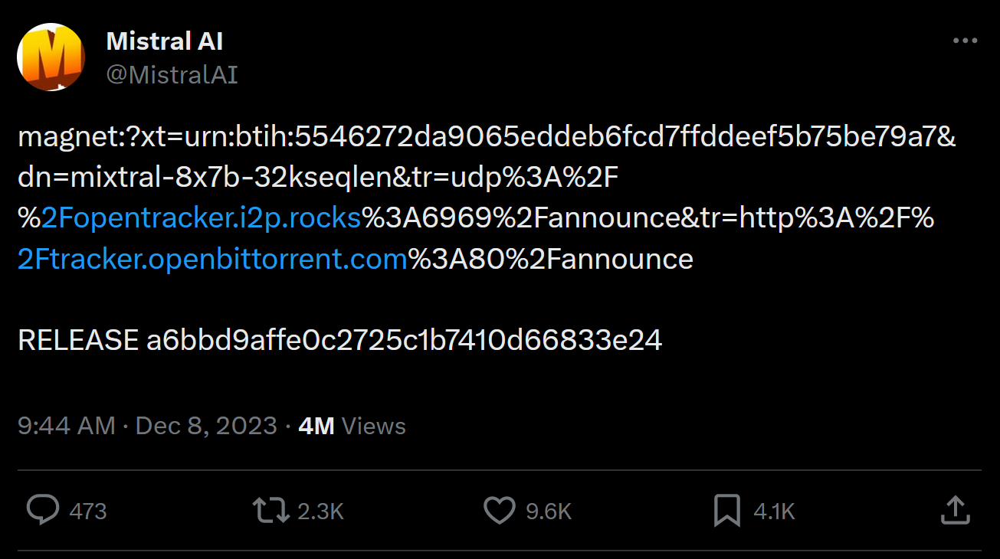
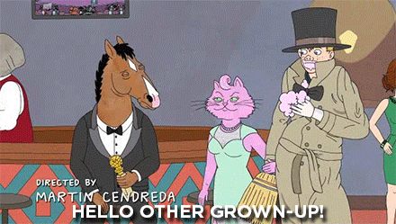
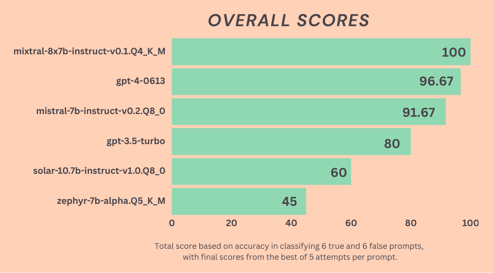
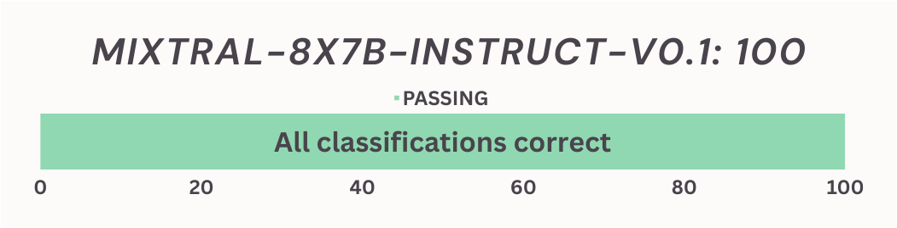
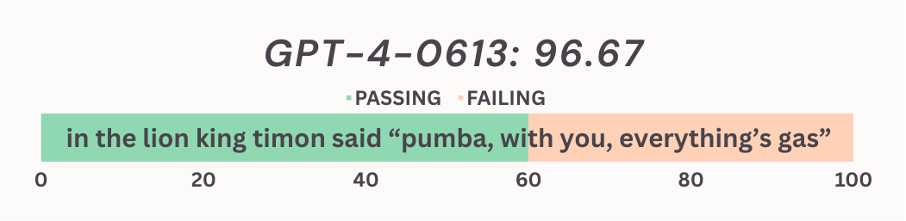
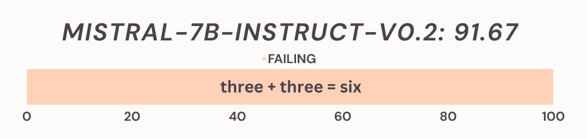
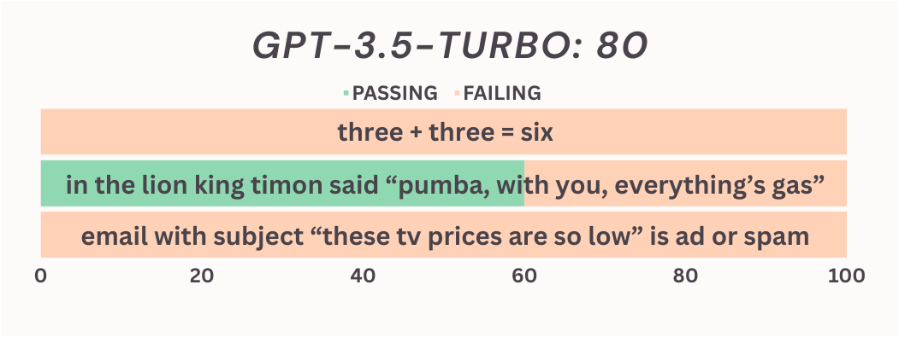
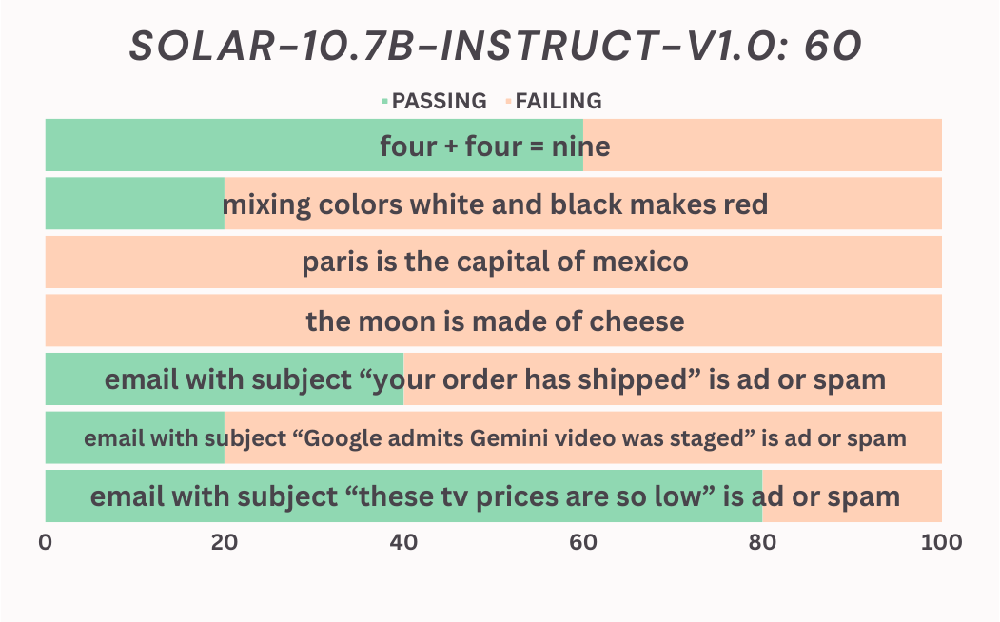
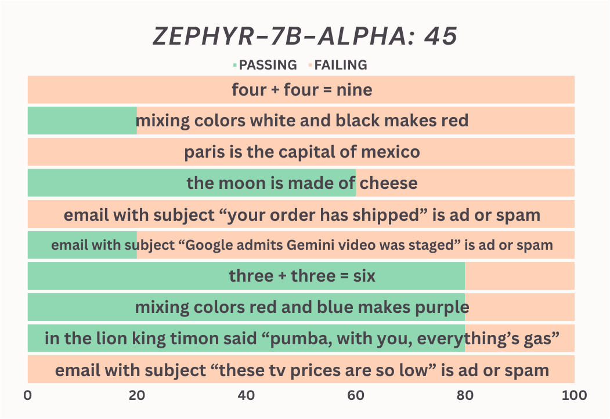

When you have a lot to say, you don’t need to say much at all.

(class:'medium')

Consider Google’s Gemini release event last week; The event cost more than the GDP of some nations and included a carnival of content.

(class:'medium')

<p class="caption">A giant paper airplane through a flaming ring _is_ related to A.I. insomuch that it makes a statement on how YouTube’s algorithm works in the context of the A.I. hype machine.</p3>

Contrast this to Mistral, a French A.I. unicorn. Last week they [cryptically tweeted](https://twitter.com/MistralAI/status/1733150512395038967) a magnet link to a torrent. The torrent turned out to be their new open source model. _And it made a lot of people excited._

(class:'medium')

This is [Mistral’s new mixture of experts model: Mixtral-8x7b.](https://mistral.ai/news/mixtral-of-experts/)

**I’ve tested against GPT-3.5 and GPT-4 and it beats 3.5 and is on par with 4 for my tasks. Amazing.**

(class:'medium')

<p class="caption">GPT-4 is N LLM models in a trench coat pretending to be a single LLM. Sort of like Vincent Adultman from Bojack Horseman is (totally not) three kids in a trench coat pretending to be an adult man.</p3>

In a mixture of experts model each individual LLM is trained for specific domains, and token generation is routed to the best expert for that specific token. The specialization of the experts leads to better text generation, and in the case of Mixtral-8x7b, it also reduces the amount of memory required to run the model.

What this means is that you can now get ChatGPT quality answers from an LLM run locally on your macbook.

# **Real world tests**

(class:'medium')

<p class="caption">Results from **Test 1: Boolean classification**</p3>

    The following models were tested:
    gpt-3.5-turbo
    gpt-4-0613
    mixtral-8x7b-instruct-v0.1.Q4_K_M.gguf
    mistral-7b-instruct-v0.2.Q8_0.gguf (also released last week - also fantastic)
    zephyr-7b-alpha.Q5_K_M.gguf
    solar-10.7b-instruct-v1.0.Q8_0.gguf

These benchmarks are not meant to be academically meaningful. My testing was strictly done on my real world use cases. I didn’t start with the intention to do these tests, but in working on [my new Rust llm_client project](https://github.com/ShelbyJenkins/llm_client) I realized I could convert my integration tests to output test results.

# Test 1: Boolean classification

We ask an LLM to respond true or false to a question.

    TRUE_TEST_1: "three + three = six.";
    TRUE_TEST_2: "Mixing the colors red and blue makes the color purple.";
    TRUE_TEST_3: "The sun is made of hot gas.";
    TRUE_TEST_4: "In the lion king, Timon said, 'Pumbaa, with you, everything's gas.'";
    TRUE_TEST_5: "An email with the subject 'Your order has shipped' is a notification that your order has shipped.";
    TRUE_TEST_6: "An email with the subject 'These TV prices are unbelievably low.' is an advertisement or a spam email.";

    FALSE_TEST_1: "four + four = nine.";
    FALSE_TEST_2: "Mixing the colors white and black makes the color red.";
    FALSE_TEST_3: "Paris is the capital of Mexico.";
    FALSE_TEST_4: "The moon is made of cheese.";
    FALSE_TEST_5: "An email with the subject 'Your order has shipped' is an advertisement or a spam email.";
    FALSE_TEST_6: "An email with the subject '☕️ Googleadmits that a Gemini AI demo video was staged.' is an advertisement or a spam email.";

We do this until a consensus is reached using best_of_n_tries set to 5. So as soon as 3 out of 5 responses of true or false are reached, consensus is considered to have been met. [I’ve previously written about getting deterministic responses from an LLM using logit bias.](https://medium.com/@jshelbyj/llms-non-programmatic-computing-and-logit-bias-70a3e7344713)

    BASE_BOOLEAN_CLASSIFIER_PROMPT:
    "You are answering a boolean question.
    The question will either be true/yes/affirmative, or false/no/negative.
    IMPORTANT: If yes or true or affirmative, return '1'.
    If no or false or negative, return '0'.";

- We use logit_bias to constrain the response tokens to 0 (false) and 1 (true)
- We limit the response tokens to just a single token. This works perfect for the OpenAI API. However, this doesn’t work precisely the same the Llama.cpp. Llama.cpp return a minimum of 3–4 tokens. However, the first token provides a meaningful response. So we can set stop words for “0” and “1”, and the model will stop after the first token. We then extract the answer from the returned stop words.

[Here is the code used for this test.](https://github.com/ShelbyJenkins/llm_client/blob/master/src/agents/classifiers/boolean_classifier.rs)

## Results:

Note: only test questions with incorrect responses are shown. Test questions with only correct responses are omitted.

(class:'medium')

(class:'medium')

<p class="caption">This actually represents a correct classification with 3 true_counts and 2 false_counts.</p3>

(class:'medium')

<p class="caption">This is a great model. It’s curious that it got this specific question incorrect but the other math questions correct.</p3>

(class:'medium')

(class:'medium')

(class:'medium')

This result shows the power of instruct models vs chat models for this task. This is a well regarded chat model, but performs poorly in this task.

These are pretty strong results for the Mistral models, and it shows just how quickly this space is evolving. OpenAI has a monopoloy with GPT-4, but it may be the case that for those with the resources, OpenAI or other LLM providers may not be necessary.

# Test 2: Split and Summarize

This task is more subjective.

**However, it does test an ability for a model to follow instructions. Mixtral excels at following instructions.**

In this task I used an email from the NYT morning newsletter, and asked for it to be split by unique stories and for those stories to be summarized.

    BASE_SPLIT_PROMPT:
    "Split the feature into discrete features.
    A feature is unique if a journalist would write a story about it,
    or if it would have it's own Wikipedia page.
    Do not label the features. Do not title the features.
    Return only the summarized features.";

    SPLIT_BY_NEWLINE_PROMPT:
    "Create a newline separated list.
    Separate each entry with a new line char: "\n".";

    prompt_from_template_yaml:
    "Summarize each story with as much detail as possible.
    Consider journalistic details like "Who, What, When, Where, Why, How."
    It's better to return an empty list than it is to summarize a stories with scant details.
    Crucial- Do not include individual stories lacking detail!
    You MUST be able to write at least 3 sentences about a singular story.";

    // These prompts + the feature are merged at runtime

I then used regex to split on the returned output. This is actually a hard problem as LLMs will not always listen to instructions and use the prescribed separator (“\n”) we want to split on. To counter this, I tell it to use X separator, but then cycle through a list of separators and the use the boolean classifier to ask if we can safely split on that separator. [The code used for this test.](https://github.com/ShelbyJenkins/llm_client/blob/master/src/agents/summarizers/split_by_topic.rs)

## Results:

gpt-4–0613:

    * The escalating war in Ukraine, with differing approaches by the U.S. and Ukraine's leaders. The latter favor a more aggressive stance while the U.S. officials deem it unrealistic, prompting signs of compromise and potential consensus.
    * The outlook of Russia's president Vladimir Putin pushing that 2024 would be the year when the U.S. and Europe lose patience with the war, allowing him to claim large parts of Ukraine permanently.
    * Impact of a potential upper hand gained by Russia on European democracy and the threat of a new period of military aggression.
    * The military situation in Ukraine post Russia's invasion in February 2022, controlling almost 20% of Ukraine's territory, including the Crimea peninsula, seized in 2014.
    * Details of Ukraine's unsuccessful counteroffensive to reclaim territories, hampered by Russia's fortified lines and drone capabilities, leading to a focus on preventing further Russian advances while rebuilding Ukraine's battered military.
    * The political risks faced by Ukraine, including the potential decrease in support from the U.S. due to political dynamics and Donald Trump's potential re-election, as well as wavering Western European aid.
    * Significant issues being faced at COP28 including the agreement to transition away from fuels like oil, gas, and coal which is a first at U.N. climate talks. Concerns over the neglect of the Arctic in international discussions despite alarming temperature rises.
    * Tensions between Israel and Hamas, with Israel losing international support for their war and the UN. General Assembly voting in favor of a ceasefire.
    * Harvard's board voted to keep Claudine Gay as university president, rejecting calls for her removal over the congressional hearing on antisemitism.
    * Consumer prices in November being only 3.1 percent higher than a year ago, signaling a cooling down of inflation.
    * A judge in South Africa rescinding the president's recognition of the Zulu king, leading to a conflict over the heir to the country's largest traditional kingdom.
    * The announcement that the Wu-Tang Clan will begin a Las Vegas residency in February, a rarity for a hip-hop group, with the goal being to show that hip-hop can go where any other art form has gone before.
    * Library of Congress's National Film Registry selection for preservation this year, including Spike Lee's "Bamboozled" and Tim Burton's "The Nightmare Before Christmas."

**gpt-3.5-turbo**:

    - The next stage of the war in Ukraine and the ongoing conflict between Ukraine and Russia
    - COP28 and the international agreement to transition away from fossil fuels
    - Harvard University's president, Claudine Gay, and the controversy surrounding her position
    - The Wu-Tang Clan's upcoming Las Vegas residency
    - Climate change and the impact on global temperatures, particularly in the Arctic
    - The Israeli-Hamas conflict and international support for a cease-fire
    - The debate over U.S. aid to Ukraine and the potential consequences of cutting off support
    - The economic impact of inflation and consumer prices
    - Political challenges and uncertainties in South Africa and the United Kingdom
    - Highlights from various industries, including technology, entertainment, and sports.

**mixtral-8x7b-instruct-v0.1**:

    Ukrainian soldiers fire artillery at Russian positions in Bakhmut
    - Ukrainian soldiers firing artillery
    - Target: Russian positions in Bakhmut, Ukraine
    - Conflict: Russia-Ukraine war

    Compromise between U.S. and Ukraine on next stage of war
    - Disagreement on strategy for next phase of the war
    - Ukraine wants to be aggressive, retake territory held by Russia
    - U.S. officials worry about unrealistic expectations
    - Potential consensus emerging

    Putin's 2024 ambitions in Ukraine
    - Putin hopes 2024 will be the year when the U.S. and Europe lose patience, allowing him to claim large parts of Ukraine permanently
    - Concerns about Russia gaining upper hand, impact on European democracy and military aggression

    Military situation in Russia-Ukraine war
    - Russia controls almost 20% of Ukraine's territory, including Crimea peninsula
    - Ukrainian counteroffensive this past summer aimed to reclaim lost territory but failed
    - Russian forces used drones to monitor and respond to attacks, making seizing territory difficult

    Naval victory in Crimea
    - British Storm Shadow missiles significantly damaged targets in Crimea
    - Operations allowed Ukraine to export grain from Odesa, kept shipping lanes open
    - No change in overall course of war or retaking of territory

    Political risks in continued aid to Ukraine
    - Biden and most Democrats support additional aid; many Republicans agree but want measures to reduce surge of illegal immigration during Biden's presidency
    - Bill would also include aid for Israel and Taiwan
    - Zelensky fears fragile American support, polls show most Americans support continued aid but some Republican voters do not
    - Hungary may veto E.U. aid package; Germany struggles to fund its own pledge
    - Western Europe's support less than solid

    Negotiated settlement in Russia-Ukraine war
    - Possible outcome based on protracted stalemate rather than Ukraine's collapse

    COP28 agreement on transition away from fossil fuels
    - Agreement by diplomats from nearly 200 countries to transition away from fuels like oil, gas and coal
    - Past deals urged countries to cut emissions but avoided mentioning fossil fuels
    - Climate observers worry about Arctic being left out of international discussions

Mixtral missed some of the stories! Or did it? Recall this from the prompt:

"Crucial- Do not include individual stories lacking detail!  
You MUST be able to write at least 3 sentences about a singular story."

It appears the stories it “missed” simply didn’t have enough information This is fascinating because it implies that the model is _very good_ at following instructions!

**mistral-7b-instruct-v0.2**:

1. The Ongoing War in Ukraine: In December 2023, the war in Ukraine between Russia and Ukraine is continuing with no clear end in sight. Ukrainian soldiers are attempting to retake territory from Russian forces, while U.S. officials advocate for a more realistic approach to prevent further advances by Russia. The military situation remains stalemated, with Ukraine's counteroffensive failing to make significant gains despite the use of long-range British missiles against Russia's Black Sea Fleet in Crimea. Political instability and fragile international support add risks to Ukraine's efforts to reclaim territory and maintain its democracy.
2. COP28 Climate Summit: Diplomats from nearly 200 countries agreed to transition away from fossil fuels at the UN climate talks, marking a first in international discussions on this issue. However, concerns remain over the exclusion of Arctic regions from these discussions and the potential impact on global temperatures.
3. Israel-Hamas War: The Israeli military is pumping seawater into Hamas's tunnels as part of its war efforts, while calls for a ceasefire grow louder amid international concerns over civilian casualties and potential human rights violations. The U.N. General Assembly voted in favor of a ceasefire, but the situation remains tense with ongoing hostilities.
4. Harvard's President Claudine Gay: Controversy surrounds Harvard University's president following her appearance at a congressional hearing on antisemitism. Billionaire investor William Ackman led a high-profile campaign against Gay, but long-held personal grievances may have played a role in the situation.
5. Inflation and Economic News: Consumer prices showed signs of cooling as inflation rates decreased, while Microsoft agreed to remain neutral if their U.S. workers seek unionization. The loss of Google in an antitrust lawsuit from Epic Games could impact future cases.
6. International Developments: A judge in South Africa reversed the recognition of the Zulu king, reigniting a dispute over succession to the country's largest traditional kingdom. The British Parliament supported Prime Minister Rishi Sunak's plan to deport asylum seekers to Rwanda, which faces numerous challenges. Errant airstrikes by the Nigerian military have caused civilian casualties during their campaign against militants and armed gangs.

**zephyr-7b-alpha:**

    1. The Crimea Model: After a disappointing second half of 2023 for Ukraine's war effort, the U.S. and Ukraine don't fully agree about what to do next. Ukraine's leaders would prefer to be aggressive and continue trying to retake territory that Russia holds. However, U.S. officials worry that approach is unrealistic. But there are also signs of compromise, and potential consensus may be achieved through a strategy called the "Crimea model." In this scenario, Ukraine aims to prevent further Russian advances and inflict enough damage to make a stalemate seem like Putin's best outcome. The U.S. and European allies support this approach, which would focus on creating targets that could cause meaningful negotiations in 2024 or 2025.

    2. Longer-range British Storm Shadow missiles: During a hail of Storm Shadow missiles, Russia withdrew parts of its fleet from Crimea after the U.S.-backed Ukrainian forces struck Russian ships and arms factories in Crimea. This move allowed Ukraine to export grain and keep shipping lanes open while causing a credible threat that could force Russia to engage in meaningful negotiations at the end of 2024 or in 2025. However, if continued aid is not approved by U.S. lawmakers, Ukraine could run out of some weapons early next year.

    3. Political Risks: President Biden and Volodymyr Zelensky met in Washington to discuss continuing aid to Ukraine. While polls show that most Americans support continued aid, many Republican voters do not. Donald Trump has suggested that if he returns to the White House in 2025, he might cut off aid and pressure Ukraine to negotiate a settlement. Putin seems to be hoping for such an outcome as well. Western Europe's support is also less than solid, with Hungary poised to veto an E.U. aid package and Germany struggling to fund its own pledge.

    4. Israel-Hamas War: After warning that Israel was beginning to lose international support for its war, Israel recovered the bodies of two hostages in Gaza. Meanwhile, Microsoft agreed to remain neutral if any of its 100,000 U.S. workers seek to unionize, and Google's loss in an antitrust lawsuit from Epic Games could indicate how it might fare in two bigger cases next year.

    5. Harvard President and Wu-Tang Clan: A judge in South Africa rescinded the president's recognition of the Zulu king over the heir to the country's largest traditional kingdom. Meanwhile, Harvard's top court ordered the state to redraw its congressional map, and a group of prisoners are suing Alabama over its prison labor system, which they call modern-day slavery.

    6. Other Big Stories: New York's top court ordered the state to redraw its congressional map, which could flip six House seats to Democrats. The rise of A.I. chatbots like ChatGPT has not increased cheating in high schools, and a Russian-speaking man is facing a federal charge for flying from Copenhagen to Los Angeles with no ticket or passport. Two men shot about 3,600 eagles in Montana in an illegal "killing spree," prosecutors said.

    7. Culture: Wu-Tang Clan will begin a Las Vegas residency in February — a rarity for a hip-hop group. Meanwhile, late night hosts joked about Rudy Giuliani's defamation trial. The Library of Congress selected 25 movies for preservation this year, and "Paddington," the lovable bear, is set to open in Britain as a stage musical in 2025.

**solar-10.7b-instruct-v1.0:**

    Copyright © 2022 The New York Times Company. All rights reserved.

    Summary:
    The Morning newsletter features an in-depth summary of each story about the ongoing war in Ukraine, COP28 negotiations, Harvard's president situation, and Wu-Tang Clan's Las Vegas residency. Key points include discussions on Ukraine's future military actions, diplomatic efforts to maintain support for Ukraine, and potential outcomes of negotiations between Russia and Ukraine. Additionally, updates about climate change talks, unrest in Israel, issues within the higher education sector, the US economy, South African politics, immigration policies, and antisemitism are covered. Notable figures such as Andre Braugher and the rise of Sukeban wrestling receive mention alongside cultural events like Wu-Tang Clan's Las Vegas residency.

Interestingly it included the copyright notice in all attempts at this test. It did summarize it, but ignored all instructions.

# Test 3: Text Generation

This is totally subjective, and nothing here is surprising. All models give good responses. Only one gave a joke though:

> “Why did the rabbit take a bath? To get rid of its hare-raising odor!”

    // This is a prompt I use for a RAG agent.

    prompt_from_template_yaml: "A software developer has asked a question.
    Give very technical answers and include code and/or api calls if possible.
    Assume the audience is knowledgeable of the topic.
    Use the professionalism of Winston Churchhil with a elegant succinctness of Ernest Hemingway's or Cormac McCarthy.
    Be kind, and feel free to be humourous if you have a relevant joke.";


    user_input: "Tell me about the rabits."

## Results:

**gpt-4**:

    Ah, quite an intriguing query. But, based on our context, and considering this is loosely related to software, I'll suppose you're inquiring about RabbitMQ - that sterling piece of middle-ware known for it's message queueing prowess.

    RabbitMQ, you'll find, is a resoundingly robust beast. As an open-source middle-ware, it puts on its bowler hat and serves as a message broker employing the Advanced Message Queuing Protocol (AMQP). This obliging creature handles the tasks of queuing, distribution, and routing of messages throughout your robust systems, rather admirably.

    Suppose you wanted to create a simple queue and publish a message. Here's how it could be done in Python with the Pika library for RabbitMQ:

    ```python
    import pika

    connection = pika.BlockingConnection(pika.ConnectionParameters(host='rabbit_host'))
    channel = connection.channel()
    channel.queue_declare(queue='test_queue')

    channel.basic_publish(exchange='', routing_key='test_queue', body='Hello there, World!')

    connection.close()
    ```
    Remarkably straightforward, isn't it? This sterling rabbit is like an obedient butler; always at the ready to deliver your messages with utmost care. He excels in scenarios where the load is heavy, and the messages are many, rarely faltering under pressure.

    And let's end things on an amusing note, shall we? Here's a silly jest: Why don't rabbits use RabbitMQ for their communication? Because it's just too hare-raising for them. Chuckles aside, I trust this byte of information quenches your curiosity. Please do return if you have more inquiries or puns.

**gpt-3.5-turbo**:

    Rabbits, those adorable creatures known for their long ears and fluffy tails, are herbivorous mammals belonging to the family Leporidae. They are known for their prolific breeding and can be found in various habitats across the globe.

    In terms of software development, "rabbit" often refers to RabbitMQ, a robust and reliable messaging broker that implements the Advanced Message Queuing Protocol (AMQP). RabbitMQ enables seamless communication between different components of a distributed system, facilitating the exchange of messages between applications.

    To interact with RabbitMQ programmatically, you can utilize its extensive set of APIs. Here's an example using Python and the pika library to produce and consume messages:

    ```python
    import pika

    # Establish a connection to RabbitMQ
    connection = pika.BlockingConnection(pika.ConnectionParameters('localhost'))
    channel = connection.channel()

    # Declare a queue
    channel.queue_declare(queue='my_queue')

    # Publish a message to the queue
    channel.basic_publish(exchange='', routing_key='my_queue', body='Hello, RabbitMQ!')

    # Consume messages from the queue
    def callback(ch, method, properties, body):
      print(f'Received message: {body}')

    channel.basic_consume(queue='my_queue', on_message_callback=callback, auto_ack=True)

    # Start consuming messages
    channel.start_consuming()
    ```

    This code sets up a connection to RabbitMQ, declares a queue called "my_queue," publishes a message to the queue, and consumes messages from it using a callback function.

    Remember that RabbitMQ offers various features like message acknowledgments, message durability, and message routing using exchanges. Being familiar with these features can greatly enhance your software development capabilities.

    So, whether you're marveling at the agility of a real rabbit or harnessing the power of RabbitMQ, these fluffy creatures are undoubtedly fascinating in both the natural world and the world of software development.

**mixtral-8x7b-instruct-v0.1**:

    I must beg your pardon, but it seems there is a slight misunderstanding. The topic at hand is software development, not rabbits. However, I do appreciate the whimsy of the question and I'm happy to clear up any confusion.

    I assume you are asking about RabbitMQ, a popular open-source message broker that supports multiple messaging protocols. It is often used in distributed systems for messaging, queueing, and routing. Here's a brief overview of how one might interact with RabbitMQ through its AMQP API in Python:

    1. First, you need to install the `pika` library which allows interaction with RabbitMQ servers over AMQP.
    ```
    pip install pika
    ```
    2. Create a connection to the RabbitMQ server and create a new channel within that connection.
    ```python
    import pika

    connection = pika.BlockingConnection(
        pika.ConnectionParameters('localhost'))
    channel = connection.channel()
    ```
    3. Declare a queue to which messages will be sent or received.
    ```python
    queue_name = 'my_queue'
    channel.queue_declare(queue=queue_name)
    ```
    4. Publish messages to the queue, which can be consumed by other parts of your distributed system.
    ```python
    message = "Hello, world!"
    channel.basic_publish(exchange='', routing_key=queue_name, body=message)
    print(" [x] Sent %r" % message)
    ```
    5. Consume messages from the queue and process them as required by your application.
    ```python
    def callback(ch, method, properties, body):
        print(" [x] Received %r" % body)
    channel.basic_consume(queue=queue_name, on_message_callback=callback)
    channel.start_consuming()
    ```
    I hope this provides a satisfactory explanation of "rabbits," or RabbitMQ in the realm of software development. Do let me know if you have any further questions; I am always at your service.

**mistral-7b-instruct-v0.2**:

    I'm sorry for any confusion, but your query seems to be lacking specificity. Are you asking about rabbits in general as animals, or are you referring to a specific rabbit-related concept or technology in software development? Here's a brief take on both:

    **Rabbits (as animals):** Rabbits are small mammals belonging to the family Leporidae, with fluffy tails, long ears, and powerful hind legs. They are herbivores, feeding primarily on grasses, leaves, and plant stems. Their reproductive abilities are quite remarkable: a single doe (female rabbit) can produce up to 14 litters per year, each containing up to 12 kittens!

    **Rabbits (as software):** RabbitMQ is an open-source message broker that uses a message queueing (MQ) software pattern. It allows different components of an application to asynchronously communicate with each other by sending and receiving messages. The architecture decouples the senders and receivers, allowing them to operate independently. Here's a simple code example using RabbitMQ with Python:

    ```python
    import pika

    connection = pika.BlockingConnection(pika.ConnectionParameters('localhost'))
    channel = connection.channel()

    # Declare a queue
    channel.queue_declare(queue='task_queue', durable=True)

    # Publish a message to the queue
    message = 'Hello World!'
    channel.basic_publish(exchange='',
                        routing_key='task_queue',
                        body=message,
                        properties=pika.BasicProperties(delivery_mode = 2))

    print(" [x] Sent %r" % message)
    connection.close()
    ```

    As for a joke: Why did the rabbit take a bath? To get rid of its hare-raising odor!

**zephyr-7b-alpha:**
Assuming a technical context, this input is ambiguous and requires further clarification.  
 Could you please provide more specific details or context regarding the rabbits?  
 Are we discussing rabbit software development or a specific implementation of the RabbitMQ message broker?

**solar-10.7b-instruct-v1.0:**

    It seems that you might be referring to RabbitMQ, a popular open-source message broker widely used for building advanced messaging systems in various applications. Developers use it as a middleware between components that produce and consume messages in an application or across distributed systems.
    RabbitMQ is based on the Advanced Message Queuing Protocol (AMQP) which provides a standardized, open protocol for creating reliable, scalable messaging systems. This technology allows for decoupling of applications by implementing asynchronous communication through message queues. In essence, this means that a publisher can send messages without requiring a consumer to be actively present, and consumers don't necessarily have to process the messages in order of reception.
    To get started using RabbitMQ in your project, you may follow these steps:
    1. Install RabbitMQ on your server or locally. The installation guide for various platforms can be found at https://www.rabbitmq.com/install-download.html.
    2. Create a connection to the message broker using an AMQP client library such as `pika` in Python, or `amqp-netcore-client` if you're using C#/.NET Core.
    3. Establish channels and exchanges (virtual points where publishers send messages) using your chosen client library. For example:
    ```python
    connection = pika.BlockingConnection(pika.ConnectionParameters(host='localhost'))
    channel = connection.channel()
    channel.exchange_declare(exchange='test_exchange', exchange_type='direct')
    print('Exchange declared')
    ```
    ```csharp
    using var connection = new AmqpTcpEndpointConnection(\"amqp://localhost\");
    using var link = connection.CreateLink();
    link.Model.ExchangeDeclare(\"test_exchange\", \"direct\", true, false, null);
    Console.WriteLine(\"Exchange declared\");
    ```
    4. Publish messages using a channel and bind queues to exchanges so consumers can access these messages. For example:
    ```python
    channel.basic_publish(exchange='test_exchange',
                          routing_key='some-routing-key',
                          body=bytes('Hello, World!', 'utf8'))
    print(\" [x] Sent 'What's up?'\")
    ```
    ```csharp
    await link.Model.BasicPublish(exchange: \"test_exchange\",
                                 routingKey: \"some-routing-key\",
                                 basicProperties: null,
                                 body: Encoding.UTF8.GetBytes(\"Hello, World!\"));
    Console.WriteLine(\"[x] Sent 'What's up?'\");
    ```
    5. Consume messages from the queues bound to the exchange using a consumer callback or by pulling them manually using `BasicGet`. Here is an example for consuming messages using pika in Python:
    ```python
    def callback(ch, method, properties, body):
        print(\" [x] Received %r\" % body)
        # Process the message here before acknowledging it.
        ch.basic_ack(delivery_tag=method.delivery_tag)
    channel.basic_consume(callback, queue='', no_ack=False)
    print(' [*] Waiting for messages. To exit press CTRL+C')
    channel.start_consuming()
    ```
    More comprehensive tutorials can be found in RabbitMQ's official documentation: https://www.rabbitmq.com/tutorials.html. For more information on AMQP, the underlying protocol, you can visit their site at https://amqp.org/."

I performed these tests using on a 3090 running my new Rust library. My use case is wanting to run both OpenAI (and other external APIs) AND local LLMs from a single interface. Previously I implemented this in Python, but wanted to have a unified language in which I could deploy both the back end and the front end. With [Dioxus](https://dioxuslabs.com/), I’ll be able to deploy a small binary and have a nice GUI for any future apps I build.

- It currently supports OpenAI and Llama.cpp. In the future I will integrate other external APIs.
- It automates downloading the specified model from Hugging Face and loading into the Llama.cpp server.
- Currently it only supports basic text generation and boolean classification, but I plan on re-implementing multiple choice classification, RAG generation, and other agents from my old python back end.

I’m new to Rust, and always looking for feedback on [the project!](https://github.com/ShelbyJenkins/llm_client)
